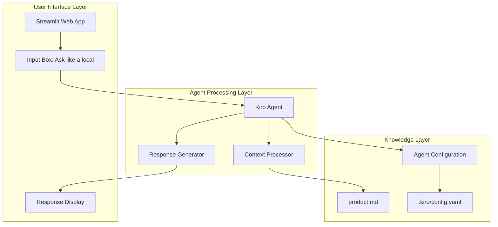

# Design Document: Bangalore Local Guide

## Overview

The Bangalore Local Guide is a Streamlit-based web application that leverages Kiro's AI agent capabilities to provide authentic local advice about Bangalore/Bengaluru. The system demonstrates context-driven AI by loading city-specific knowledge from a single source file (product.md) and using it to power intelligent responses through a configured Kiro agent.

The application follows a clean separation of concerns: knowledge management (product.md), agent configuration (.kiro/config.yaml), and user interface (app.py). This architecture ensures maintainability while showcasing how external context can enhance AI agent capabilities.

## Architecture

The system follows a three-tier architecture:



**Data Flow:**
1. User submits query through Streamlit interface
2. Application loads product.md content as context
3. Context and query are passed to configured Kiro agent
4. Agent processes query using loaded knowledge
5. Response is generated and displayed to user

## Components and Interfaces

### Streamlit Application (app.py)
**Purpose:** Web interface for user interactions
**Key Functions:**
- `load_context()`: Reads and returns product.md content
- `initialize_agent()`: Sets up Kiro agent with configuration
- `process_query(query, context)`: Handles user input and generates responses
- `main()`: Streamlit app entry point and UI layout

**Interface:**
```python
def load_context() -> str
def initialize_agent() -> KiroAgent
def process_query(query: str, context: str) -> str
def main() -> None
```

### Context Manager
**Purpose:** Manages loading and formatting of Bangalore knowledge
**Responsibilities:**
- Load product.md file content
- Handle file reading errors gracefully
- Format context for agent consumption
- Validate context completeness

### Kiro Agent Configuration
**Purpose:** Defines agent behavior and persona
**Configuration File:** `.kiro/config.yaml`
**Key Properties:**
- Agent identity: "bangalore-local-guide"
- Persona: Friendly Bangalore local
- Behavior rules and constraints
- Response formatting guidelines

### Knowledge Base (product.md)
**Purpose:** Single source of truth for Bangalore information
**Content Sections:**
- City overview and basic information
- Languages and communication
- Local slang dictionary with explanations
- Traffic patterns and transportation
- Food recommendations by area and time
- Cultural norms and etiquette
- Practical local tips

## Data Models

### Query Model
```python
@dataclass
class UserQuery:
    text: str
    timestamp: datetime
    session_id: str
```

### Context Model
```python
@dataclass
class LocalContext:
    content: str
    source_file: str
    last_updated: datetime
    
    def is_valid(self) -> bool:
        return bool(self.content and self.source_file)
```

### Response Model
```python
@dataclass
class AgentResponse:
    content: str
    confidence: float
    sources_used: List[str]
    slang_explained: List[Dict[str, str]]
```

### Agent Configuration Model
```yaml
# .kiro/config.yaml structure
name: bangalore-local-guide
description: Friendly Bangalore local guide
persona:
  identity: Bangalore local resident
  tone: helpful, practical, culturally aware
  style: concise but informative
behavior_rules:
  - explain_slang_when_used
  - recommend_food_by_time
  - warn_about_traffic_realistically
  - suggest_metro_during_peaks
  - no_hallucination_policy
context_sources:
  - product.md
```

## Correctness Properties

*A property is a characteristic or behavior that should hold true across all valid executions of a system-essentially, a formal statement about what the system should do. Properties serve as the bridge between human-readable specifications and machine-verifiable correctness guarantees.*

Let me analyze the acceptance criteria to determine testable properties.

### Converting EARS to Properties

Based on the prework analysis and property reflection, here are the key correctness properties:

**Property 1: Context-driven responses**
*For any* user query, all responses should be based exclusively on information present in product.md, with no hardcoded or external knowledge
**Validates: Requirements 2.1, 2.3, 4.5**

**Property 2: Context update consistency**
*For any* modification to product.md, subsequent responses should reflect the updated information
**Validates: Requirements 2.4**

**Property 3: Slang explanation completeness**
*For any* response containing Bangalore slang terms, explanations for those terms should be included in the response
**Validates: Requirements 1.2, 4.1**

**Property 4: Time-aware food recommendations**
*For any* food-related query with time context, recommendations should be appropriate for the specified time of day
**Validates: Requirements 1.1, 4.2, 9.4**

**Property 5: Traffic-aware transportation advice**
*For any* traffic or transportation query, responses should include realistic congestion warnings and suggest metro alternatives during peak hours when appropriate
**Validates: Requirements 1.3, 4.3, 4.4, 9.3**

**Property 6: Comprehensive query handling**
*For any* valid query type (food, traffic, culture, itinerary, slang), the system should generate appropriate responses using loaded context
**Validates: Requirements 1.4, 1.5, 5.4, 6.3, 9.1, 9.2, 9.5**

**Property 7: Context loading reliability**
*For any* application startup, product.md content should be successfully loaded and made available to the agent
**Validates: Requirements 6.1, 6.2**

**Property 8: Session context persistence**
*For any* user session, context should remain consistent across multiple queries within that session
**Validates: Requirements 6.4**

**Property 9: Graceful error handling**
*For any* context loading failure, the system should handle the error gracefully without crashing
**Validates: Requirements 6.5**

## Error Handling

The system implements comprehensive error handling across all layers:

### Context Loading Errors
- **Missing product.md**: Display user-friendly error message and guidance
- **Corrupted content**: Validate file format and provide recovery instructions
- **Permission issues**: Handle file access errors gracefully

### Agent Configuration Errors
- **Missing config.yaml**: Use default configuration with warning
- **Invalid configuration**: Validate config structure and provide error details
- **Agent initialization failure**: Fallback to basic response mode

### Runtime Errors
- **Network issues**: Handle Streamlit connectivity problems
- **Processing timeouts**: Implement reasonable timeout limits
- **Memory constraints**: Optimize context loading for large files

### User Input Validation
- **Empty queries**: Prompt user for valid input
- **Malformed requests**: Sanitize and process best-effort responses
- **Rate limiting**: Implement basic request throttling if needed

## Testing Strategy

The testing approach combines unit tests for specific functionality with property-based tests for universal correctness guarantees.

### Unit Testing
Unit tests will verify specific examples and edge cases:
- Context file loading with various file states
- Agent configuration parsing and validation
- Streamlit UI component rendering
- Error handling scenarios
- Integration between components

### Property-Based Testing
Property-based tests will validate universal properties using the **Hypothesis** library for Python:
- Minimum 100 iterations per property test
- Each test tagged with: **Feature: bangalore-local-guide, Property {number}: {property_text}**
- Comprehensive input generation for query types
- Context modification testing for consistency
- Response validation against loaded context

**Test Configuration:**
```python
from hypothesis import given, strategies as st
import pytest

# Example property test structure
@given(st.text(min_size=1))
def test_context_driven_responses(query):
    """Feature: bangalore-local-guide, Property 1: Context-driven responses"""
    response = process_query(query, loaded_context)
    assert all_facts_in_response_exist_in_context(response, loaded_context)
```

### Integration Testing
- End-to-end user journey testing
- Streamlit app startup and shutdown
- File system integration testing
- Agent configuration loading

### Test Data Management
- Sample product.md files for testing
- Mock agent configurations
- Predefined query sets for regression testing
- Performance benchmarks for response times

The dual testing approach ensures both specific functionality works correctly (unit tests) and universal properties hold across all inputs (property tests), providing comprehensive coverage for the Bangalore Local Guide application.